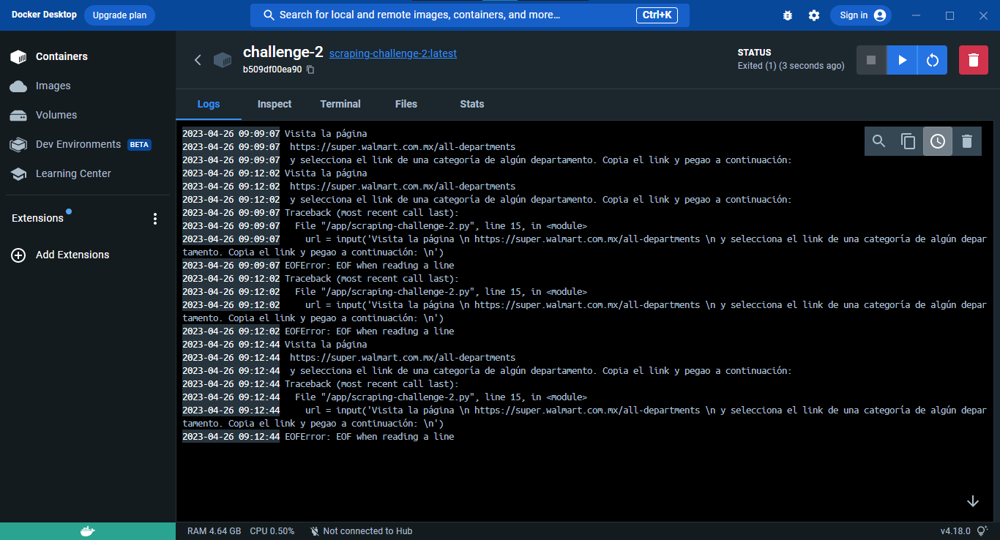

# Reporte Challenge Técnico #2
## Web Scraping con Python y BeautifulSoup

#### F. Javier Morales M.

- #### Sitio: Cualquier link de las categorias de los departamaentos en https://super.walmart.com.mx/all-departments

- #### Se pide el link al ejecutar el programa

## Sistema y herramientas
- **Windows 10** Pro x64 21H2
- **Anaconda3** - conda 4.11.0
- **Python 3.11.3** en ambiente virtual (conda env)
- **Atom** Editor 1.55.0
- **Docker Desktop** 4.18.0
- **git** version 2.30.1.windows.1
- **GitHub**

## Librerías utilizadas
- `Requests`: Para el acceso al sitio web.
- `BeautifulSoup`:  para la manipulación de contenido ***html***.
- `json`: Para la generación de contenido estructurado `JSON`.


## Procedimiento
Se le pide al usuario que visite la página https://super.walmart.com.mx/all-departments y que seleccione un link de una categoría de algún departamento y que se introduzca en la linea de comandos
```python
url = input('Visita la página \n https://super.walmart.com.mx/all-departments \n y selecciona el link de una categoría de algún departamento. Copia el link y pegao a continuación: \n')
```

Posteriormente se da tratamiento al código `html` identificando los elementos tag que contienen la información de ***nombre***, ***precio*** y ***url*** de los productos:

```python
header = {'User-Agent': 'Mozilla/5.0 (Windows NT 10.0; Win64; x64) AppleWebKit/537.36 (KHTML, like Gecko) Chrome/58.0.3029.110 Safari/537.36 Edge/16.16299'}
response = requests.get(url, headers=header)
soup = bs(response.text, 'html.parser')
url_h3s = soup.find_all('a', {'class': r'absolute w-100 h-100 z-1 hide-sibling-opacity'})
h3s = [h.text for h in url_h3s]
prices = [p.text for p in soup.find_all('div', {'class': 'mr1 mr2-xl b black lh-copy f5 f4-l'})]
urls = [u.get('href') for u in url_h3s]
```

Se imprime la variable `result` en la linea de comandos y se genera el archivo `JSON` con la función `dump()` de la librería `json`:

```python
print(result)
with open('challenge-2.json', 'w', encoding='utf-8') as f:
    json.dump(result, f, ensure_ascii=False, indent=4)

```

Al final se obtiene la información estructurada en el archivo `challenge-2.json`:

```json
{
    "Pan Bimbo cero cero 610 g": {
        "Precio": "$57.50",
        "Url": "https://super.walmart.com.mx/ip/pan-bimbo-cero-cero-610-g/00750103046709"
    },
    "Pan blanco Bimbo grande 680 g": {
        "Precio": "$47.00",
        "Url": "https://super.walmart.com.mx/ip/pan-blanco-bimbo-grande-680-g/00750100011120"
    },
    "Pan integral Bimbo grande 680 g": {
        "Precio": "$50.00",
        "Url": "https://super.walmart.com.mx/ip/pan-integral-bimbo-grande-680-g/00750100011145"
    },
    ...
    etc
}
```

## Dockerfile
Se instaló la aplicación de escritorio **Docker Desktop** descargando el instalador desde la página oficial de [Docker](https://www.docker.com/). Una vez instalado es necesario cerrar sesión para iniciar el programa.

Posteriormente se elaboró el siguiente `Dockerfile` en la carpeta del proyecto:

```bash
# Imagen base de Python
FROM python:3.10

# Directorio del contenedor
WORKDIR /app

# Archivos necesarios para el contenedor
COPY requirements.txt ./
COPY scraping-challenge-2.py ./

# Instalacion de dependencias
RUN pip install --no-cache-dir -r requirements.txt

# Ejecucion del script
CMD ["python", "scraping-challenge-2.py"]

```

Desde la linea de comandos se generó la imagen del contenedor con el siguiente comando, utilizando el parámetro `--tag, -t` para darle un nombre a la imagen (`scraping-challenge-1`).

```bash
docker build -t scraping-challenge-2 .
```

## Detalles del Dockerfile
Se obtuvieron errores al correr la imagen ya que al parecer no se puede introducir texto en la terminal del contenedor. Por otro lado en mi terminal de windows no hubo problema alguno.

Resultado de la linea de comandos

